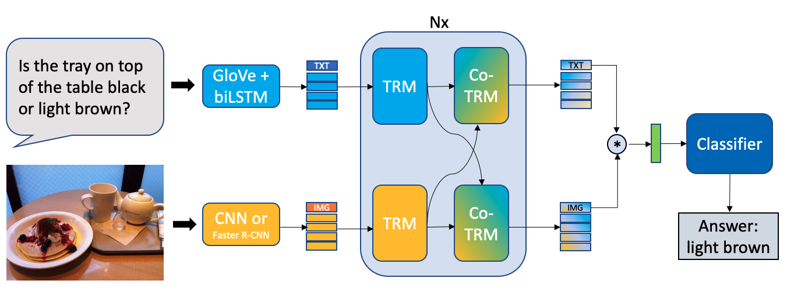
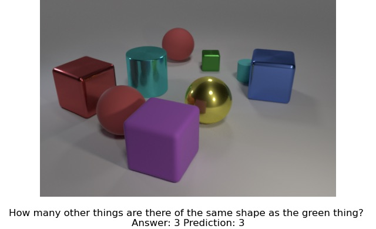
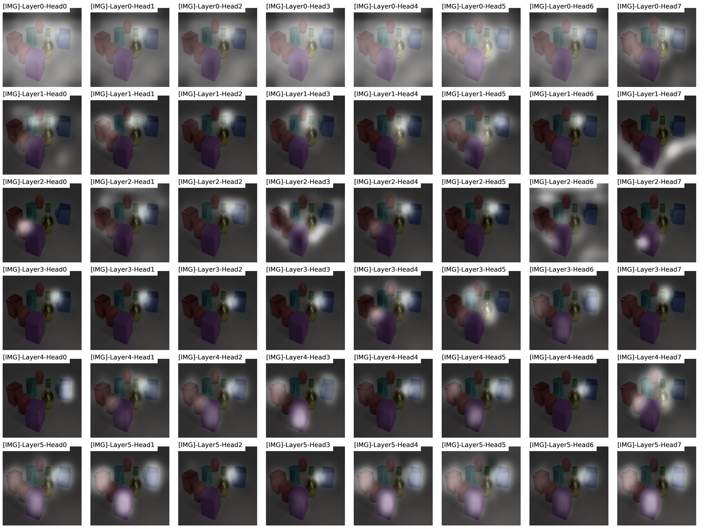

# Multimodal Learning and Reasoning for Visual Question Answering
This repository contains the [dissertation](Dissertation/MSc_Dissertation.pdf), [presentation slides](Presentation/msc-project-slides.pdf), [project plan](Project%20Plan/Project%20Plan.pdf), [project brief](Project%20Brief/Project%20Brief.pdf) and [project poster](Project%20Poster/poster.pdf) for my MSc Project at University of Southampton. The dissertation also provides extensive review of various deep learning architectures, including CNN, RNN, LSTM, attention mechanism, visual attention, self-attention, Transformer, BERT and state-of-the-art visual question answering models.

## Abstract
Current deep learning systems are very successful in sensory perception and pattern recognition (e.g. object detection and speech recognition). However, they often struggle in tasks with a compositional nature which require more deliberate thinking and multi-step reasoning. In this work, we study how we can improve the reasoning capability of artificial neural networks in the context of visual question answering (VQA) and visual reasoning. These two tasks are challenging multimodal research problem, which requires fine-grained understanding of both image and question, and typically demands the ability to perform multi-step inferences. As part of this work, we develop a new VQA model based on the novel Transformer architecture, utilising both self-attention and co-attention mechanism for dealing with multimodal input. Experimental results demonstrate that Transformer based model can be effective in a visual reasoning task, as our model achieves strong results on both CLEVR and GQA dataset with 98.3% and 56.28% accuracy respectively. Our analysis shows that the model learns to look around the image and iteratively focus on parts of the image that are relevant to finding an answer, indicating that it is capable of performing multi-step reasoning.

## Code
Implementation of the baseline models and proposed VQA model, as well as code for the experiments can be found [here](https://github.com/markvasin/openvqa) and [here](https://github.com/markvasin/vqa_project).
The model was implemented using Python and PyTorch deep learning library. I also used two frameworks to help with the development of the VQA model - [MMF](https://github.com/facebookresearch/mmf) and [OpenVQA](https://github.com/MILVLG/openvqa).

## Analysis
Example of visualisation of the reasoning process of the model. For more details, please see the analysis section in the [dissertation](Dissertation/MSc_Dissertation.pdf).

	

